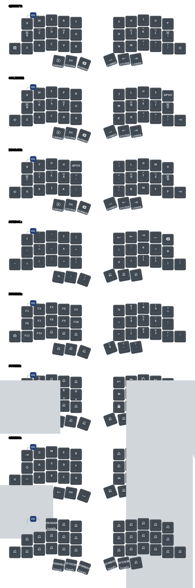

<picture>
  <source media="(prefers-color-scheme: dark)" srcset="/docs/images/TOTEM_logo_dark.svg">
  <source media="(prefers-color-scheme: light)" srcset="/docs/images/TOTEM_logo_bright.svg">
  
</picture>

# ZMK CONFIG FOR THE TOTEM SPLIT KEYBOARD

[Here](https://github.com/GEIGEIGEIST/totem) you can find the hardware files and build guide.\
[Here](https://github.com/GEIGEIGEIST/qmk-config-totem) you can find the QMK config for the TOTEM.

TOTEM is a 38 key column-staggered split keyboard running [ZMK](https://zmk.dev/) or [QMK](https://docs.qmk.fm/). It's meant to be used with a SEEED XIAO BLE or RP2040.

This configuration features:
- **8 layers**: QWERTY, COLEMAK, ENGRAM, SYMBOL, NUMBER, SYSTEM, GAMING, LOWER
- **Home row mods**: GUI, ALT, CTRL, SHIFT on both halves with positional hold-tap
- **Layer switching**: Layer-tap on thumb keys for easy access to all layers

## Instructions

### Initial Setup

1. [Fork this repository](https://docs.github.com/en/get-started/quickstart/fork-a-repo#forking-a-repository)
2. [Enable GitHub Actions](https://docs.github.com/en/actions/managing-workflow-runs-and-deployments/managing-workflow-runs/disabling-and-enabling-a-workflow#enabling-a-workflow) by clicking the **Actions** tab
3. Push any change to trigger the first build, or manually run the workflow

### Building Firmware

The firmware is automatically built by GitHub Actions when you push changes to:
- `config/**` files (keymap, configuration)
- `.github/workflows/build.yml`

To manually trigger a build:
1. Go to the **Actions** tab in your GitHub repository
2. Select the **Build ZMK firmware** workflow
3. Click **Run workflow**

### Downloading Firmware

1. Go to the **Actions** tab
2. Click on the latest successful workflow run
3. Scroll down to **Artifacts** and download `firmware.zip`
4. Extract the ZIP file to get the `.uf2` firmware files

### Flashing Firmware

1. **Connect the left half** of the TOTEM to your PC using USB
2. **Enter bootloader mode** by double-clicking the reset button on the XIAO BLE
3. The keyboard should appear as a mass storage device (like a USB drive)
4. **Drag and drop** the `totem_left-xiao_ble-zmk.uf2` file onto the drive
5. The keyboard will automatically reboot once flashing is complete
6. **Repeat for the right half** using `totem_right-xiao_ble-zmk.uf2`

### Using Keymap Editor

This configuration is compatible with the [Keymap Editor](https://nickcoutsos.github.io/keymap-editor/) tool:

1. Open [Keymap Editor](https://nickcoutsos.github.io/keymap-editor/)
2. Connect your GitHub account
3. Select your forked repository
4. Edit your keymap visually
5. Commit changes to trigger a new firmware build

## Keymap Diagram

## Layers Overview

| Layer   | Description                                           |
|---------|-------------------------------------------------------|
| QWERTY  | Standard QWERTY layout with home row mods             |
| COLEMAK | Colemak-DH layout with home row mods                  |
| ENGRAM  | Engram layout with home row mods                      |
| SYMBOL  | Symbols, brackets, and special characters             |
| NUMBER  | Number row, function keys (F1-F12)                    |
| SYSTEM  | Navigation, Bluetooth, system controls                |
| GAMING  | Gaming-optimized layout (no home row mods)            |
| LOWER   | Layer switching and base layer selection              |

## Home Row Mods

The home row keys double as modifiers when held:

| Key Position | Left Hand | Right Hand |
|--------------|-----------|------------|
| Pinky        | GUI       | GUI        |
| Ring         | ALT       | ALT        |
| Middle       | CTRL      | CTRL       |
| Index        | SHIFT     | SHIFT      |

## Troubleshooting

### Keyboard not connecting
1. Try clearing Bluetooth bonds: On SYSTEM layer, press BT CLR
2. Re-pair the keyboard with your device

### Split halves not communicating
1. Make sure both halves are charged/powered
2. Flash both halves with the latest firmware
3. Turn both halves off, then on again

### Reset the keyboard
1. Flash the left half with the firmware
2. The settings will be reset to defaults

## ZMK Version

This configuration uses ZMK **v0.3.0** with the new board naming convention (`xiao_ble//zmk`). 

To update to a newer version, edit `config/west.yml` and change the `revision` value. See [ZMK releases](https://github.com/zmkfirmware/zmk/releases) for available versions.

## Resources

- [ZMK Documentation](https://zmk.dev/docs)
- [ZMK Keycodes](https://zmk.dev/docs/codes/)
- [TOTEM Hardware](https://github.com/GEIGEIGEIST/totem)
- [Keymap Editor](https://nickcoutsos.github.io/keymap-editor/)
